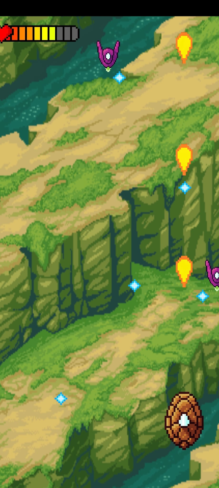
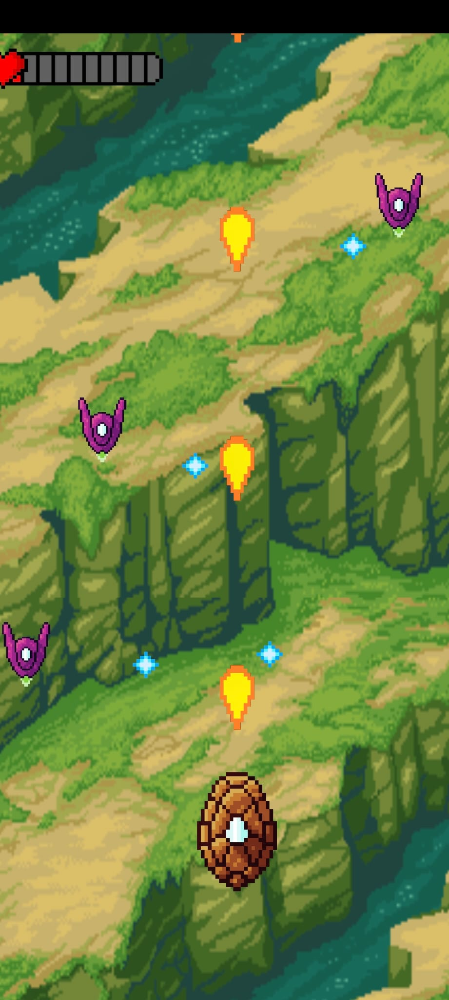

# AliensWars - 2D Pixel Game 🎮🚀

## Overview
Alien Invasion is a classic 2D pixel art game inspired by the legendary Space Invaders. In this game, you control a fighter plane tasked with defending Earth from waves of alien invaders. Shoot down enemies, avoid obstacles, and rack up points in a fast-paced arcade-style environment!

This game is built with a retro aesthetic in mind, providing a nostalgic experience for fans of the original arcade games while adding modern twists like power-ups and boss battles.

## Features 🌟
- **Pixel Art Design**: Classic retro-style visuals that capture the charm of old-school games.
- **Wave System**: Battle increasingly difficult waves of alien invaders.
- **Power-ups**: Collect special items to boost your plane's abilities, including:
  - Triple-shot lasers
  - Shields
  - Speed boosts
- **Boss Fights**: Face off against unique alien bosses after every few waves.
- **High Score Tracking**: Beat your personal best and climb the leaderboard!

## How to Play 🚀
**Objective**:
    - Destroy as many aliens as you can while dodging their attacks.
    - Survive through multiple waves of enemies, with each wave getting progressively harder.
    - Watch out for power-ups to boost your plane’s performance.

Screenshots 🖼️

Solarized dark             |  Solarized Ocean
:-------------------------:|:-------------------------:
  |  
